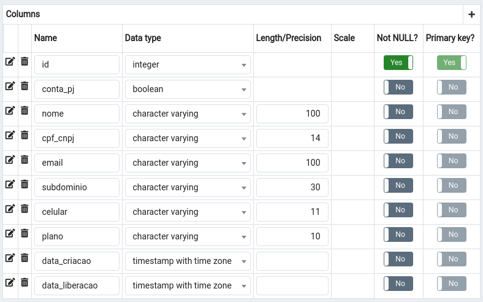
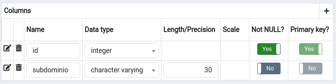

# DESAFIO QUALYVIST

Prezado candidato, este desafio tem por objetivo avaliar o conhecimento, a qualidade do código entregue e a capacidade de análise dos pretendentes a trabalhar na equipe de desenvolvimento do sistema QUALYVIST.

## Descrição

O desafio consiste em implementar uma tela de cadastro completa, com as opção de Inclusão, Edição, Exclusão e Pesquisa de dados, sendo implementado o lado Client e o lado Server(API REST), para total funcionamento do sistema. A implementação deve seguir os requisitos aqui descritos.

O sistema QUALYVIST é um software ofertado como serviço (Saas), dessa forma, temos uma área administrativa de uso interno para podermos controlar as contas dos clientes, faturas, pagamentos, etc.

Para este desafio foi escolhido a implementação da tela de controle das Contas de cliente, ela é composta dos seguintes campos:

* Tipo de Conta (PF ou PJ)
* Nome ou Razão Social
* CPF ou CNPJ
* E-mail
* Subdomínio
* Celular
* Plano
* Data de criação (somente leitura)
* Data de liberação (somente leitura)

A estrutura da tabela do banco de dados é apresentada na imagem abaixo. 

**Nota:** _O campo ID deve ser como Serial, para haver o autoincremento sempre que um novo registro é incluído._

## Requisitos do Client

* O client deve ser desenvolvido com React;
* Deve ser utilizado os componentes da biblioteca PrimeReact (https://primefaces.org/primereact/);
* A classe da tela Contas deve herdar da classe GenericForm, disponibilizada na estrutura básica do projeto;

### Regras de negócio

* É obrigatório o preenchimento de todos os campos;
* Deve-se validar o conteúdo do campo CPF/CNPJ para aceitar apenas CPFs ou CNPJs válidos, dependendo do tipo de conta;
* Deve-se validar o conteúdo do campo e-mail  para aceitar apenas e-mails válidos;
* Deve-se validar o campo subdomínio, pesquisando se outra Conta já está utilizando o subdomínio informado, ou se o conteúdo consta na lista de subdomínios reservados. Para isso deve-se utilizar a API de subdomínios reservados, disponível no projeto Server;
* Os planos disponíveis são QUALY_ONE e QUALY_PLUS, deve-se utilizar um componente de ComboBox para o usuário escolher o plano;

## Requisitos do Server

* A aplicação servidora deve utilizar o banco de dados PostgreSQL;

    **Obs**: a estrutura disponibilizada nesse repositório já está preparada para isso. Deve-se analisar os fontes disponíveis para realizar a configuração necessária para a conexão com o banco de dados.

* A API de Contas deve ser implementada na rota /conta;

* No diretório server/modules/conta já tem os arquivos que devem ser implementados;

A imagem abaixo apresenta estrutura da tabela de Subdomínios reservados.

# Processo de Candidatura

* Fazer o clone deste repositório;
* Criar uma branch com NOME_SOBRENOME e realizar o desenvolvimento;
* Adicionar na raiz do projeto um arquivo chamado contato.txt com seu nome, e-mail e telefone para contato;
* Criar um Pull Request para realizarmos a análise e avaliação do seu desenvolvimento;

## Dúvidas?

Dúvidas podem ser encaminhadas para leonardo.davi.machado@gmail.com com o assunto "Dúvida - Desafio Qualyvist".
